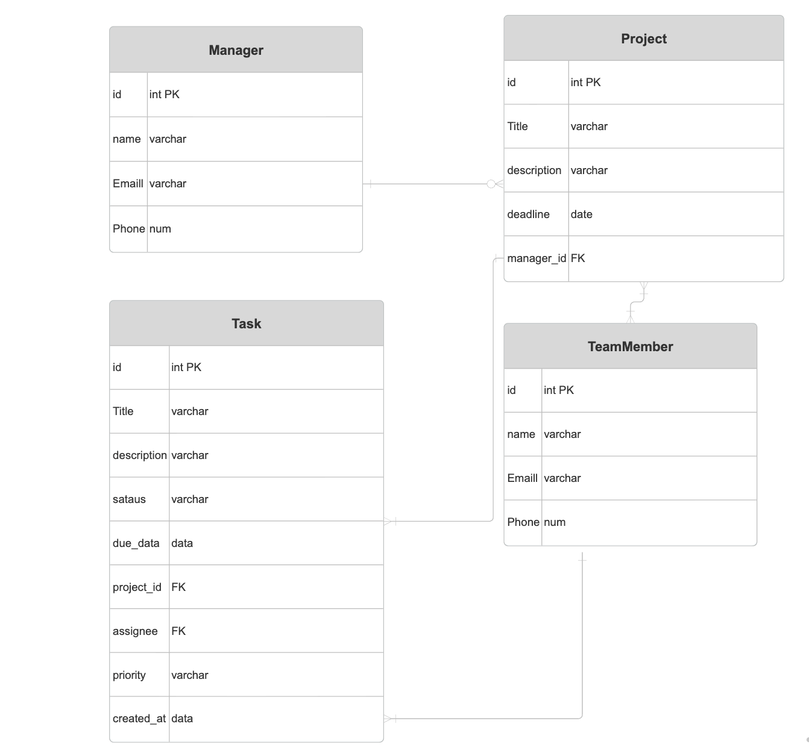

# Work Wize

______________________ 

## Description

Workwize is a fully integrated,  project that represents  the skills I've learned in the software engineering Bootcamp. It's a project and task management system designed for businesses and teams to streamline workflows efficiently. The application allows users to create workspaces, manage tasks, assign team members, and monitor progress through an interactive dashboard. The backend was developed using Python, the Django REST framework (DRF), and PostgreSQL, while the frontend was built using React and Tailwind CSS, with JWT authentication for secure access.

## ✅ Getting Started / Code Installation

To run this project locally, follow these steps:

---

### **📌 1. Clone the repositories**

```
git clone git@github.com:AbrarAlabbad77/workWize_backend.git
git clone git@github.com:AbrarAlabbad77/workWize_frontend.git
```

---

### **📌 2. Navigate to the project folder**
Backend:
```
cd workWize_backend
```

Frontend:
```
cd workWize_frontend
```

---

### **📌 3. Create & activate a virtual environment (Backend only)**

```
python -m venv venv
source venv/bin/activate
```

---

## ✅ Technologies Used

| Area          | Technologies |
|---------------|--------------|
| **Backend**   | Python, Django REST Framework (DRF), PostgreSQL |
| **Frontend**  | React, Tailwind CSS |
| **Dev Tools** | Git, GitHub |

---

## ✅ Planning

### 📌 Entity Relationship Diagram (ERD)


